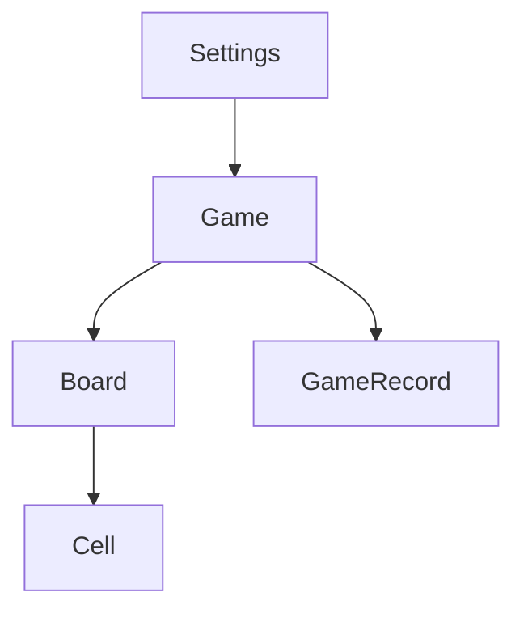

# Data Model: 数独学习游戏

## 实体定义

### Game (游戏)

代表一局正在进行或已完成的数独游戏。

**属性**:
- id: string (唯一标识符)
- boardSize: BoardSize (棋盘大小: 4 | 6 | 9)
- difficulty: Difficulty (难度: 'easy' | 'medium' | 'hard' | 'expert')
- board: Board (当前棋盘状态)
- startTime: number (开始时间戳)
- endTime: number | null (结束时间戳)
- status: GameStatus ('idle' | 'playing' | 'paused' | 'completed')
- errorCount: number (错误次数)
- moveCount: number (步数)

**验证规则**:
- 游戏开始时status为'playing'
- 游戏暂停时status为'paused'
- 游戏完成时status为'completed'且endTime不为null

### Board (棋盘)

代表数独棋盘的当前状态。

**属性**:
- size: BoardSize (棋盘大小)
- cells: Cell[][] (二维格子数组)
- boxWidth: number (宫格宽度)
- boxHeight: number (宫格高度)

### Cell (格子)

代表棋盘上的单个格子。

**属性**:
- row: number (行号)
- col: number (列号)
- value: number | null (当前值)
- solution: number (正确值)
- isPrefilled: boolean (是否预填数字)
- isCorrect: boolean | null (是否正确)
- isSelected: boolean (是否选中)
- isHighlighted: boolean (是否高亮)

**验证规则**:
- value为null表示空格子
- isPrefilled为true的格子不能被修改
- isCorrect在用户输入时验证

### GameRecord (游戏记录)

代表已完成游戏的历史记录。

**属性**:
- id: string (唯一标识符)
- boardSize: BoardSize (棋盘大小)
- difficulty: Difficulty (难度)
- initialBoard: number[][] (初始棋盘)
- finalBoard: number[][] (最终棋盘)
- solution: number[][] (正确解)
- duration: number (用时秒数)
- errorCount: number (错误次数)
- moveCount: number (步数)
- completedAt: number (完成时间戳)
- isCompleted: boolean (是否完成)

### Settings (设置)

代表用户的个性化设置。

**属性**:
- defaultBoardSize: BoardSize (默认棋盘大小)
- defaultDifficulty: Difficulty (默认难度)
- soundEnabled: boolean (声音开关)
- animationEnabled: boolean (动画开关)

## 枚举类型

### BoardSize

4 | 6 | 9

### Difficulty

'easy' | 'medium' | 'hard' | 'expert'

### GameStatus

'idle' | 'playing' | 'paused' | 'completed'

## 关系图

## 状态转换

### Game Status转换

- idle → playing (开始新游戏)
- playing → paused (暂停游戏)
- paused → playing (继续游戏)
- playing → completed (完成游戏)
- completed → idle (开始新游戏)

## 数据持久化

- Game: 存储在localStorage中，页面刷新后可恢复
- GameRecord: 存储在localStorage中，保留历史记录
- Settings: 存储在localStorage中，跨会话保持
